# Feedback Widget Mobile

React Native mobile app built with Expo SDK 55.

## Screenshots

### Home & Feedback

| Home Screen | Send Feedback (EN) | Send Feedback (ES) | Send Feedback (PT) |
|:---:|:---:|:---:|:---:|
| 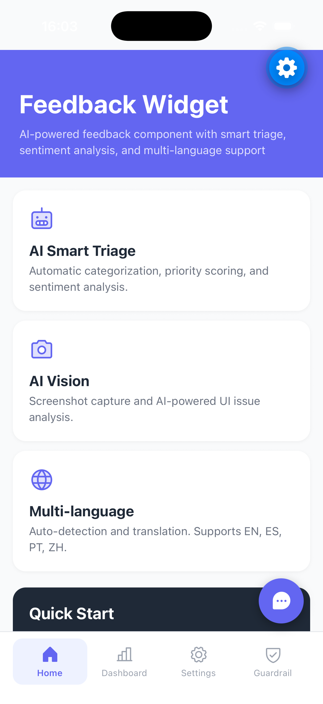 | 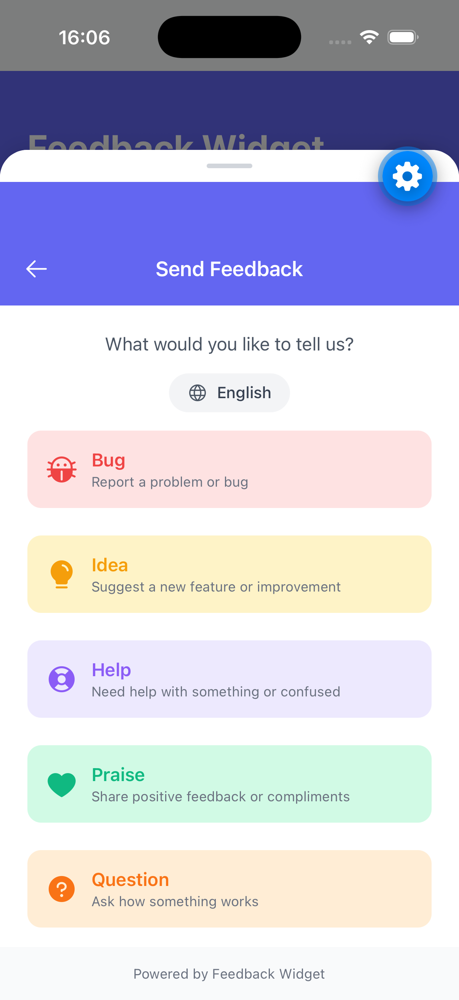 | 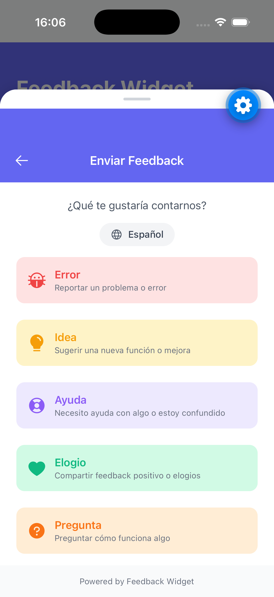 | 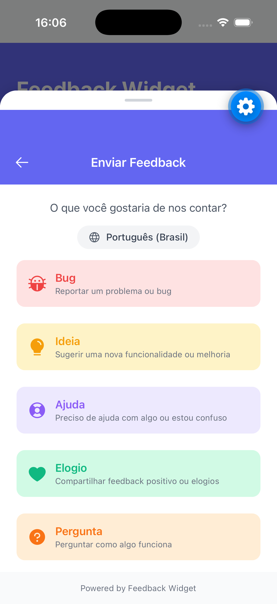 |

| Send Feedback (ZH) | Home (Chinese) | Settings |
|:---:|:---:|:---:|
| 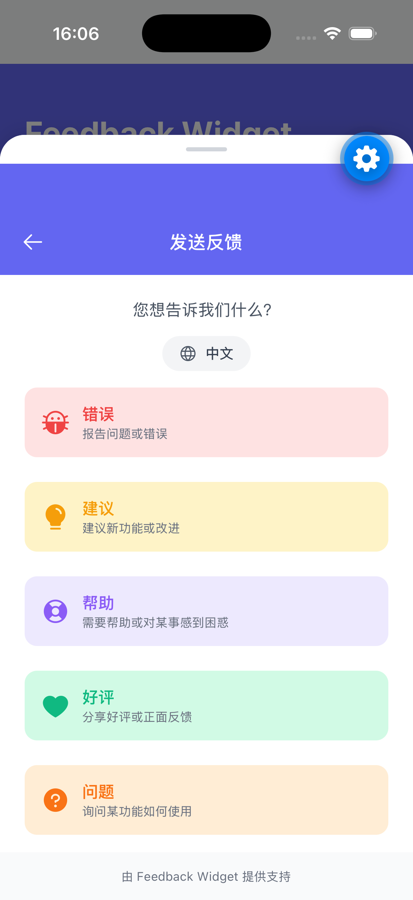 | 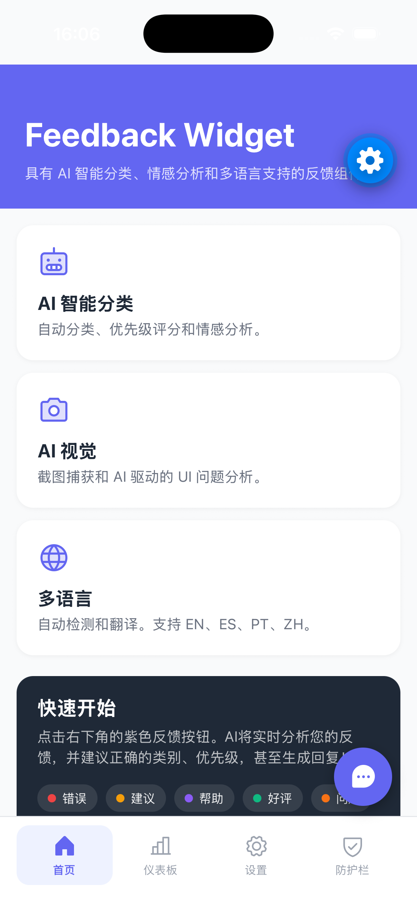 | 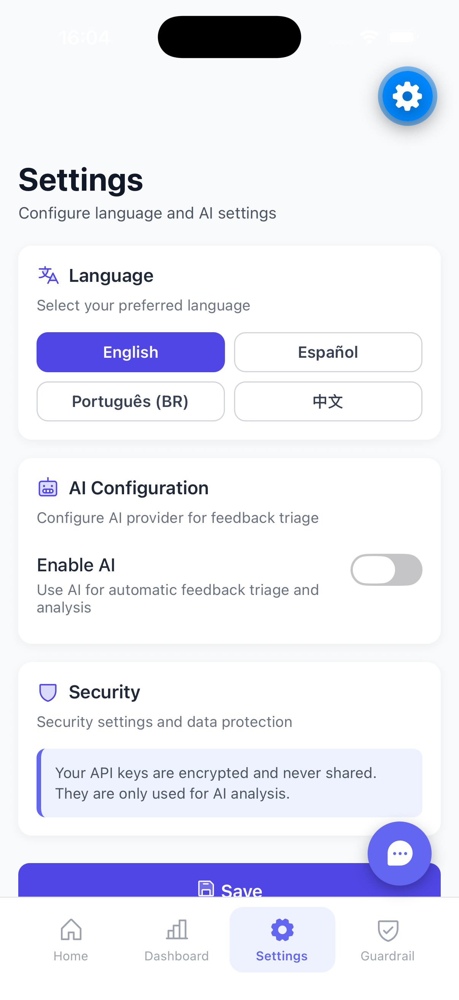 |

### AI Configuration

| Enable AI | Moonshot Setup (EN) | Moonshot Setup (PT) | API Key |
|:---:|:---:|:---:|:---:|
| 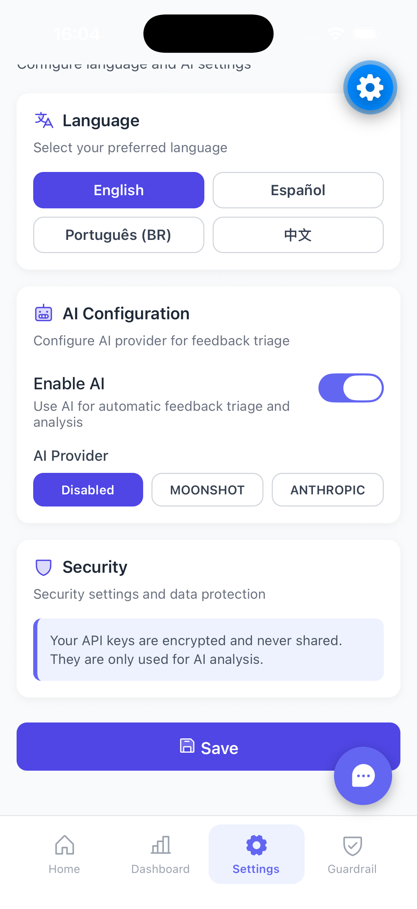 | 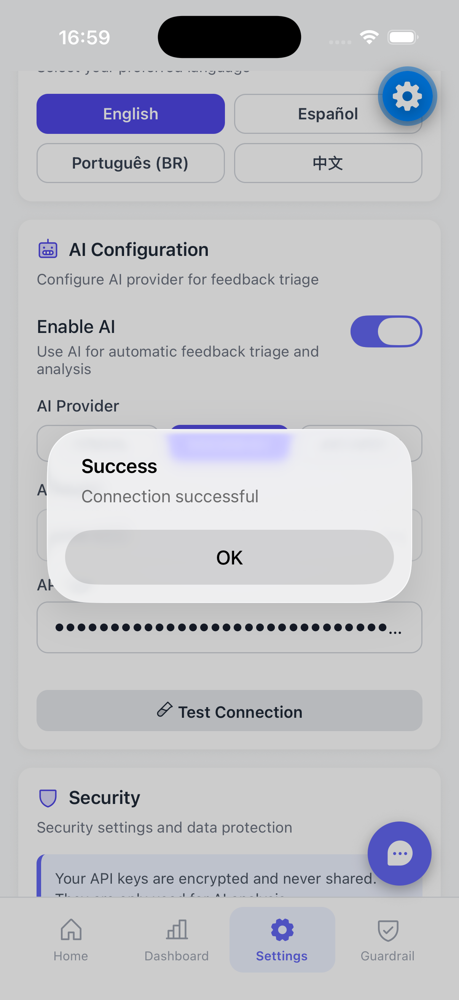 | 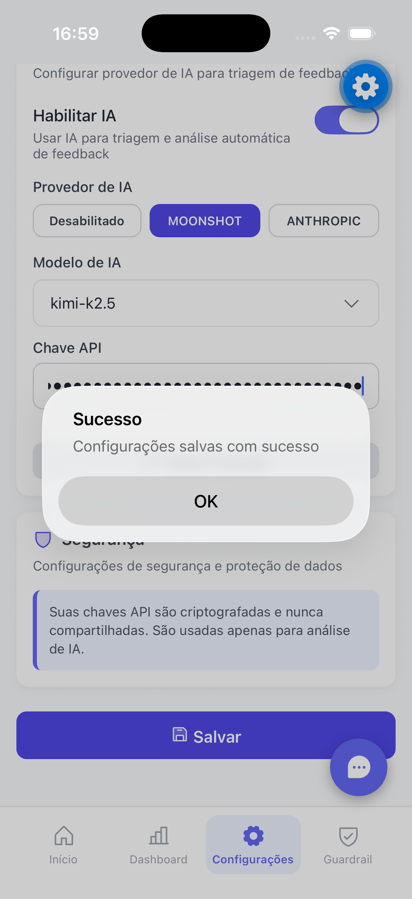 | 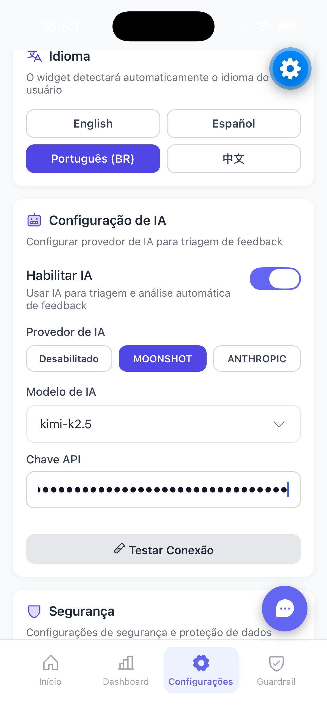 |

| Enable Moonshot | Saved Settings |
|:---:|:---:|
| 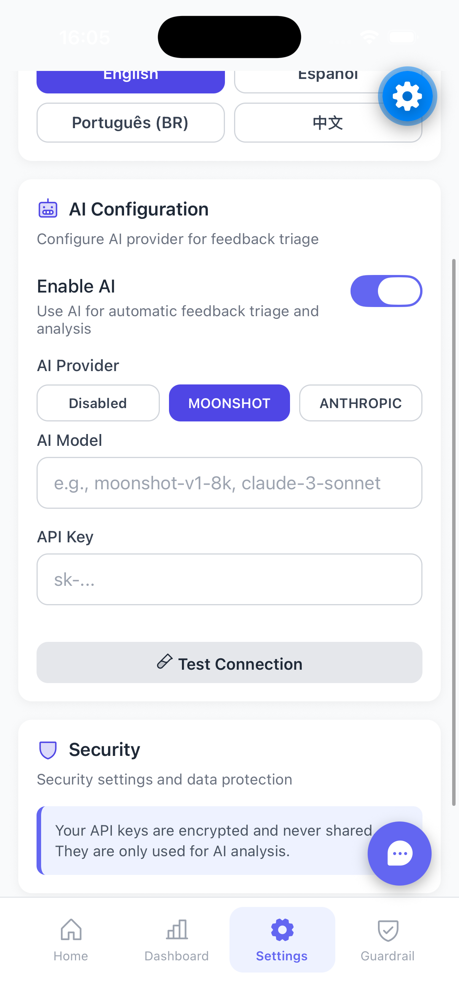 | 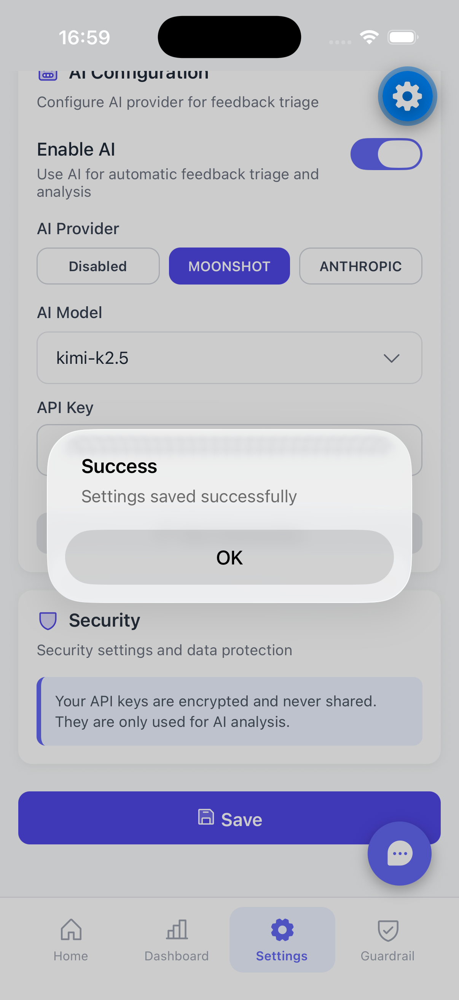 |

### Guardrail Settings

| Guardrail Screen | Guardrail Settings | Guardrail Disabled |
|:---:|:---:|:---:|
| 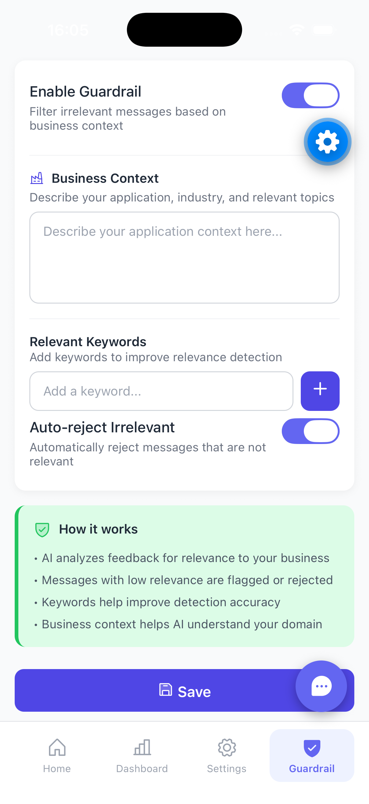 | 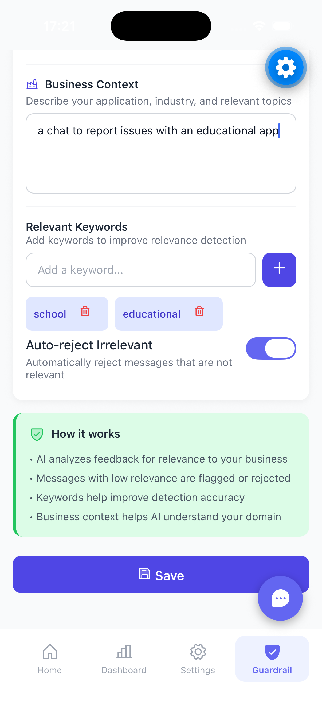 | 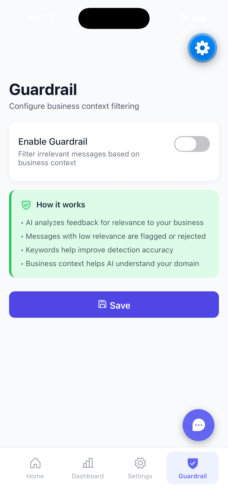 |

### Dashboard Stats

| Empty Stats | English Stats | Resolved Stats |
|:---:|:---:|:---:|
| 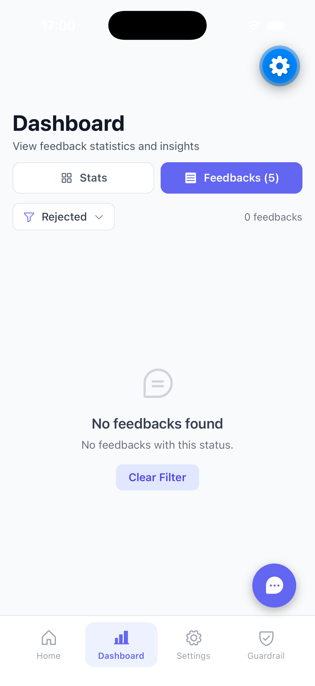 | 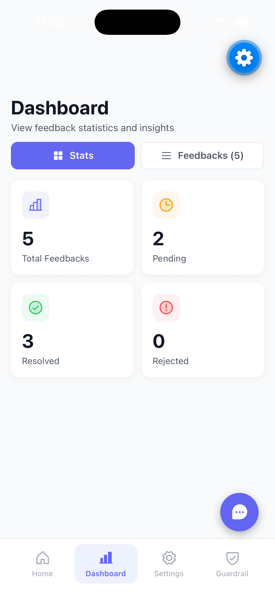 | 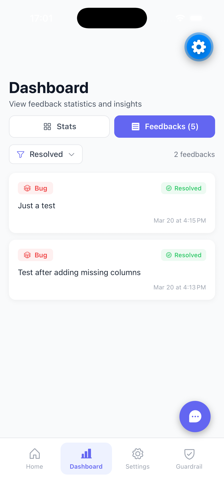 |

---

## Features

- Internationalization (i18n): 4 languages (EN, ES, PT-BR, ZH)
- AI-powered feedback analysis with guardrails
- Dashboard for feedback management
- Settings for AI configuration
- Clean Architecture implementation

## Installation

```bash
cd mobile
npm install
```

## Running

```bash
# Start Expo
npm start

# Or run directly on platform
npm run android
npm run ios
```

## Project Structure

```
mobile/
├── src/
│   ├── components/          # UI Components
│   │   ├── ai/             # AI Components (pending)
│   │   ├── FeedbackButton.tsx
│   │   ├── FeedbackForm.tsx      # Needs update
│   │   ├── FeedbackTypeButton.tsx
│   │   └── ScreenshotButton.tsx  # Needs ViewShot
│   ├── hooks/              # Custom Hooks
│   │   ├── useAI.ts        # AI hooks ✅
│   │   └── index.ts
│   ├── i18n/               # Translations ✅
│   │   ├── index.ts
│   │   └── locales/
│   │       ├── en.ts
│   │       ├── es.ts
│   │       ├── pt-BR.ts
│   │       └── zh.ts
│   ├── screens/            # Screens (pending)
│   │   ├── DashboardScreen.tsx
│   │   ├── SettingsScreen.tsx
│   │   └── GuardrailScreen.tsx
│   ├── services/           # API Services ✅
│   │   └── api.ts
│   ├── store/              # State Management ✅
│   │   └── index.ts
│   ├── theme/              # Theme/Colors
│   │   └── colors.ts
│   └── types/              # TypeScript Types ✅
│       └── index.ts
├── App.tsx                 # Main App
└── package.json
```

## Development

1. **Install dependencies**:
```bash
npm install
```

2. **Configure environment**:
   - Update API URL in `src/services/api.ts` if needed
   - Default points to `http://127.0.0.1:3333`

3. **Test with backend**:
   - Ensure backend is running
   - Test AI features integration

## Dependencies Added

- `@react-native-async-storage/async-storage` - Persistence
- `zustand` - State management
- `phosphor-react-native` - Icons (already installed)

## Notes

- Fixed position widget (no drag & drop)
- BottomSheet for feedback form
- All translations available in `src/i18n/locales/`
