# Feedback Widget Web

Frontend for the Feedback Widget - built with Astro, React, and Tailwind CSS. Implements Clean Architecture for maintainable and testable code.

## Screenshots

### Widget UI

| English UI | Chinese UI | Feedback Types |
|:---:|:---:|:---:|
| 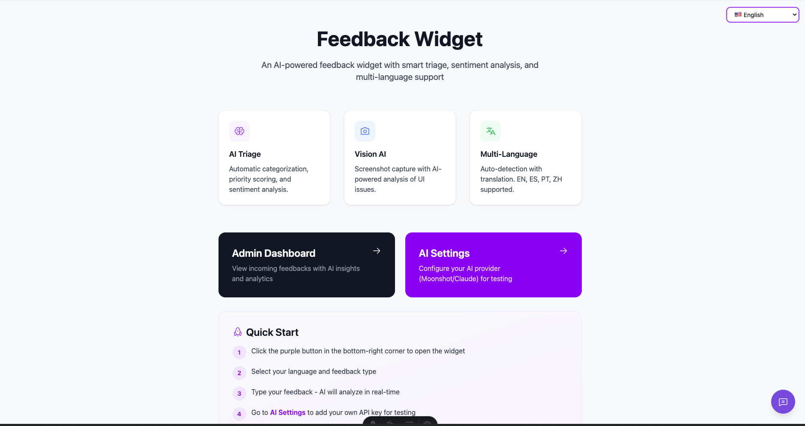 | 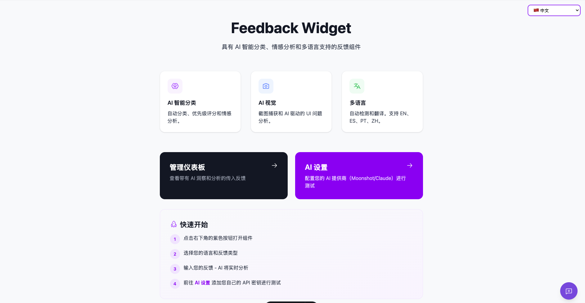 | 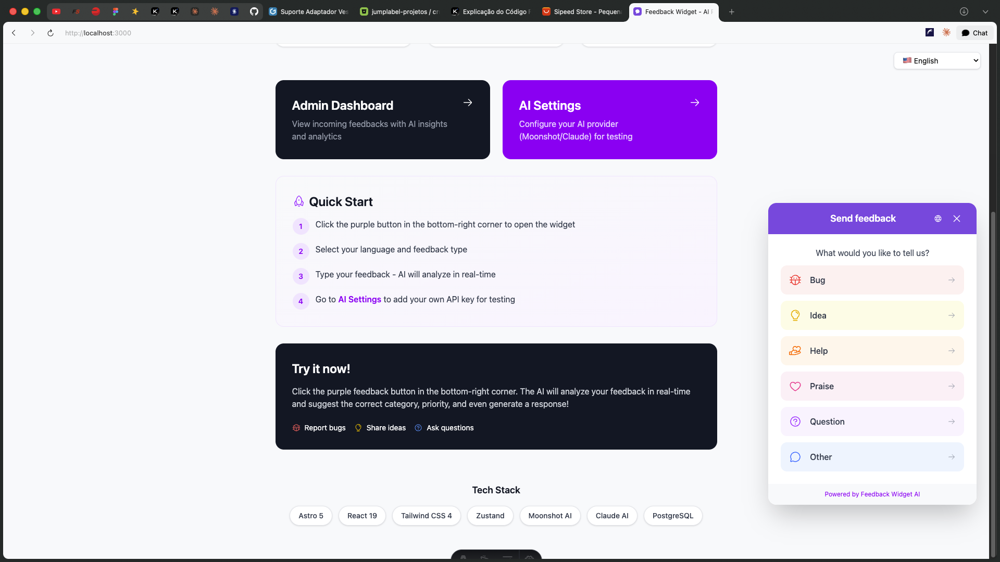 |

### Feedback Flow

| Send Feedback | Feedback Sent | Triage Running | Rejected Feedback |
|:---:|:---:|:---:|:---:|
| 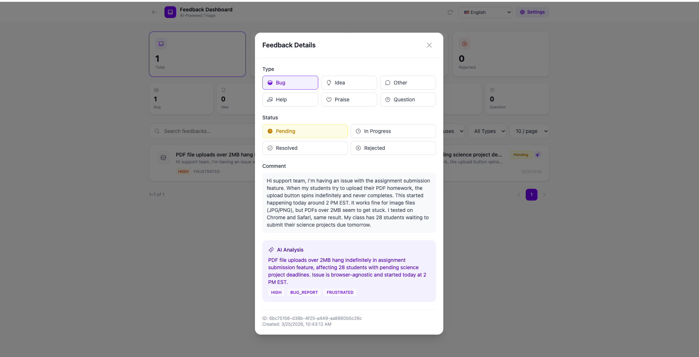 | 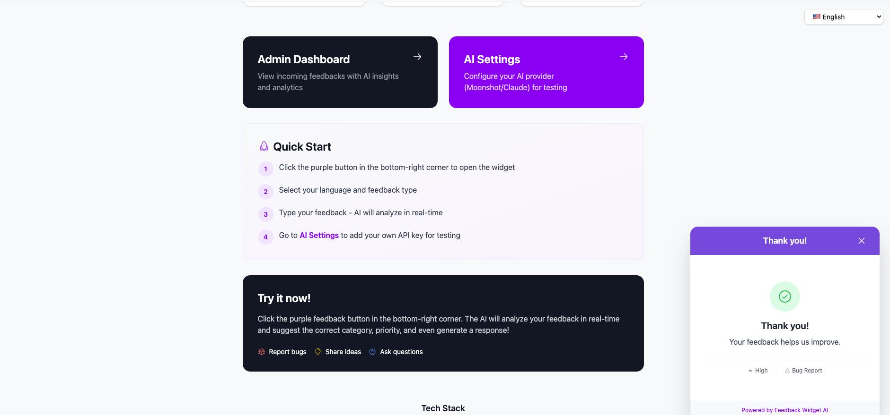 | 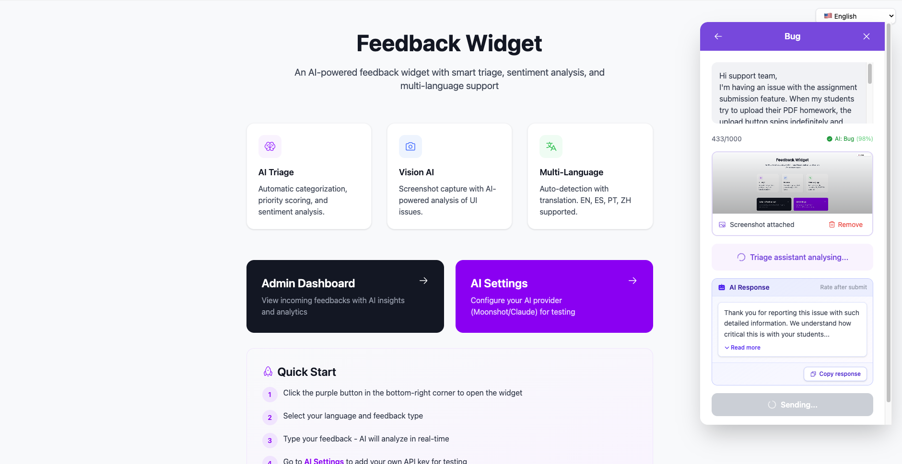 | 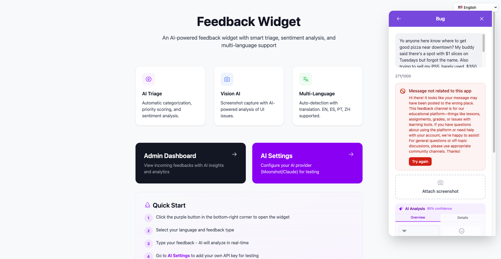 |

| Chat Message | Type Mismatch |
|:---:|:---:|
| 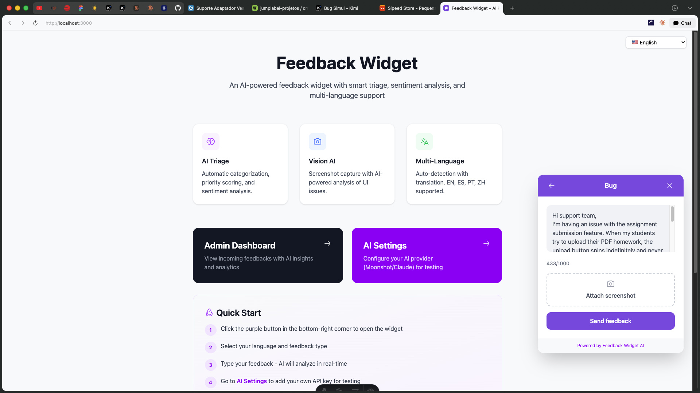 | 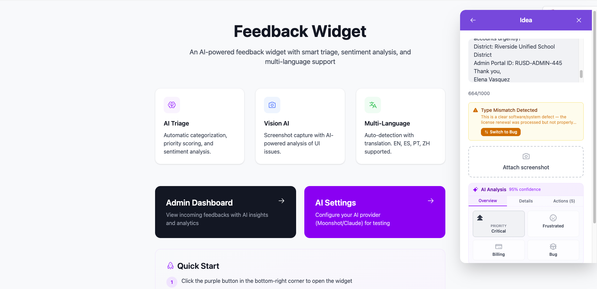 |

| Rate Feedback |
|:---:|
| 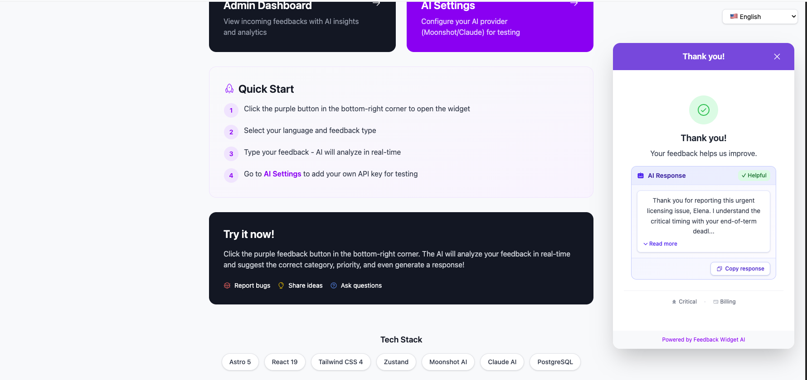 |

### Dashboard

| Empty Dashboard | Dashboard with Data | Dashboard with Rating |
|:---:|:---:|:---:|
| 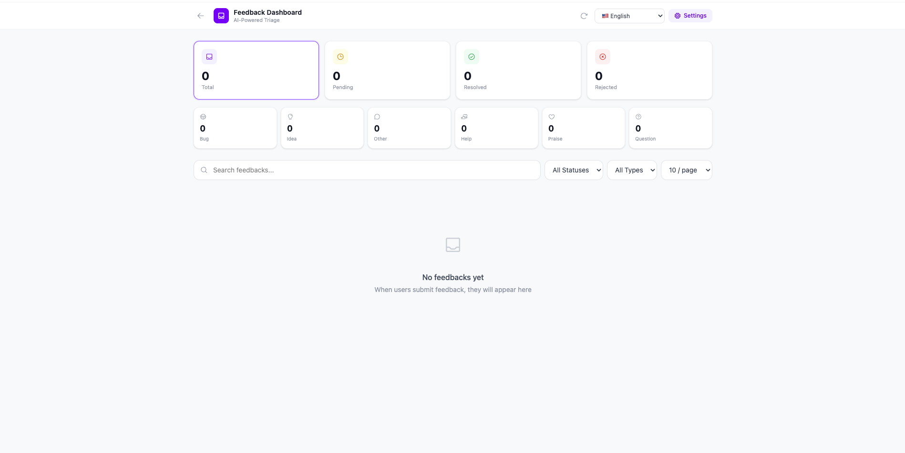 | 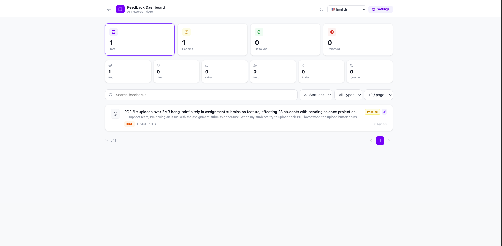 | 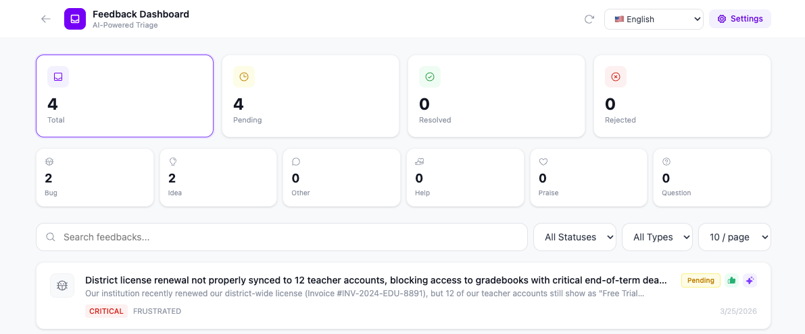 |

### AI Settings

| Settings | Enable AI | Add API Key | Moonshot Key |
|:---:|:---:|:---:|:---:|
| 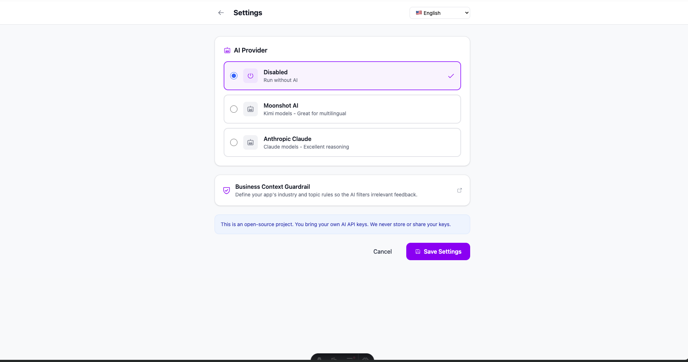 | 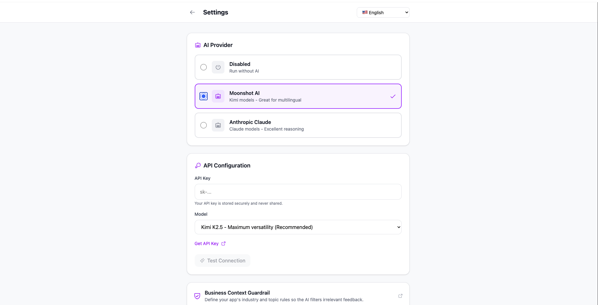 |  | 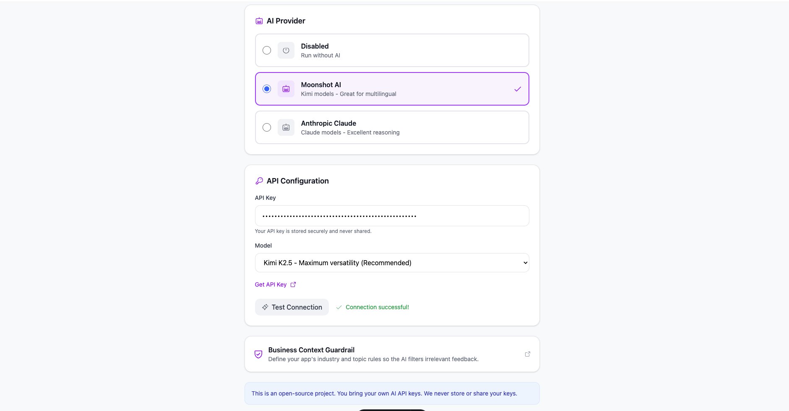 |

### Guardrail Context

| Context Settings |
|:---:|
| 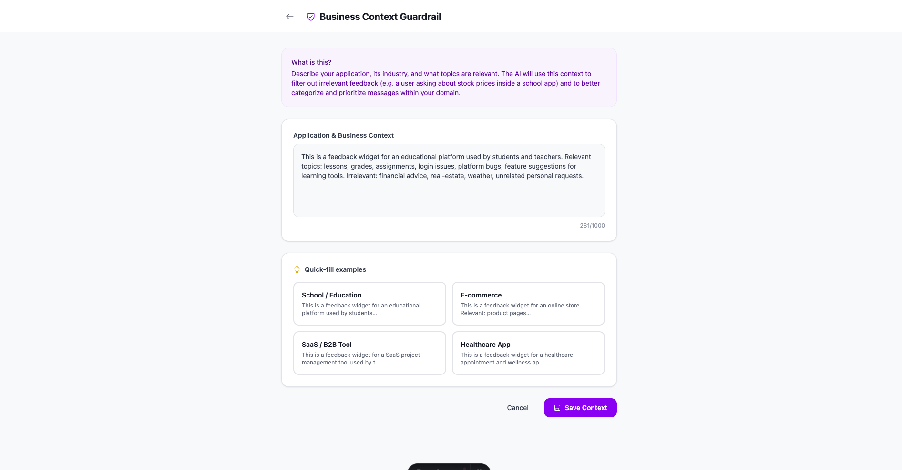 |

## Quick Start

```bash
cd web

# 1. Install dependencies
npm install

# 2. Setup environment
cp .env.example .env
# Edit .env with your API URL

# 3. Start development server
npm run dev
```

## Project Structure

```
src/
├── domain/               # Core business logic
│   ├── entities/         # Domain models
│   └── repositories/     # Repository interfaces
├── application/          # Use cases (orchestration)
├── infrastructure/       # API client, HTTP repos
├── presentation/         # UI layer
│   ├── components/       # React components
│   └── hooks/            # Custom hooks
├── lib/                  # Utilities (i18n, crypto, store)
├── pages/                # Astro pages
├── layouts/              # Astro layouts
├── styles/               # Global styles
└── container.ts          # DI Container
```

## Scripts

| Command | Description |
|---------|-------------|
| `npm run dev` | Start development server |
| `npm run build` | Build for production |
| `npm run preview` | Preview production build |
| `npm run lint` | Run ESLint |

## Environment Variables

See `.env.example` for all options.

**Required:**
- `PUBLIC_API_URL` - Backend API URL

**Optional:**
- `PUBLIC_DEFAULT_LANGUAGE` - Default widget language (en, es, pt-BR, zh)
- `PUBLIC_WIDGET_POSITION` - Widget position (bottom-right, bottom-left, etc)
- `PUBLIC_WIDGET_COLOR` - Brand color hex (without #)

## Architecture

The frontend follows **Clean Architecture** principles with clear separation of concerns:

```
┌─────────────────────────────────────────────────────────────┐
│                  PRESENTATION LAYER                          │
│         (Components, Hooks, UI State)                       │
├─────────────────────────────────────────────────────────────┤
│                  APPLICATION LAYER                           │
│              (Use Cases - Orchestration)                    │
├─────────────────────────────────────────────────────────────┤
│                    DOMAIN LAYER                              │
│      (Entities, Value Objects, Repository Interfaces)       │
├─────────────────────────────────────────────────────────────┤
│                  INFRASTRUCTURE LAYER                        │
│    (API Client, HTTP Repositories, Storage)                 │
└─────────────────────────────────────────────────────────────┘
```

### Layer Responsibilities

#### Domain Layer

**Pure business logic** - no external dependencies.

```typescript
// domain/entities/Feedback.ts
export class Feedback {
  constructor(
    public readonly id: string,
    public readonly type: FeedbackType,
    public readonly comment: string,
  ) {}

  static create(input: CreateFeedbackInput): Feedback {
    // Validation logic
    if (input.comment.length < 3) {
      throw new Error('Comment must be at least 3 characters');
    }
    return new Feedback(...);
  }

  isHighPriority(): boolean {
    return this.aiAnalysis?.priority === 'CRITICAL' || 
           this.aiAnalysis?.priority === 'HIGH';
  }
}
```

**Rules:**
- No imports from React, API, or external libraries
- Pure TypeScript/JavaScript
- Contains business rules and validation

#### Application Layer

**Orchestrates use cases** - coordinates domain and infrastructure.

```typescript
// application/use-cases/SubmitFeedbackUseCase.ts
export class SubmitFeedbackUseCase {
  constructor(private feedbackRepository: IFeedbackRepository) {}

  async execute(input: CreateFeedbackInput): Promise<SubmitFeedbackResult> {
    // 1. Domain validation
    const feedback = Feedback.create(input);

    // 2. Call infrastructure through interface
    const result = await this.feedbackRepository.submit(input);

    return result;
  }
}
```

**Rules:**
- Depends only on domain layer
- No UI framework dependencies
- One use case per file

#### Infrastructure Layer

**External concerns** - HTTP, storage, etc.

```typescript
// infrastructure/api/ApiClient.ts
export class ApiClient {
  async post<T>(path: string, body: unknown): Promise<T> {
    const response = await fetch(`${this.baseUrl}${path}`, {
      method: 'POST',
      headers: { 'Content-Type': 'application/json' },
      body: JSON.stringify(body),
    });
    return this.handleResponse<T>(response);
  }
}

// infrastructure/repositories/HttpFeedbackRepository.ts
export class HttpFeedbackRepository implements IFeedbackRepository {
  constructor(private apiClient: ApiClient) {}

  async submit(input: CreateFeedbackInput): Promise<SubmitFeedbackResult> {
    return this.apiClient.post('/feedbacks', input);
  }
}
```

**Rules:**
- Implements domain interfaces
- Can use external libraries
- Swappable implementations

#### Presentation Layer

**UI components and hooks**.

```typescript
// hooks/useSubmitFeedback.ts
export function useSubmitFeedback() {
  const [isSubmitting, setIsSubmitting] = useState(false);

  const submit = useCallback(async (input: CreateFeedbackInput) => {
    setIsSubmitting(true);
    try {
      // Use the use case through DI container
      return await container.submitFeedbackUseCase.execute(input);
    } finally {
      setIsSubmitting(false);
    }
  }, []);

  return { submit, isSubmitting };
}
```

**Rules:**
- Depends on application layer
- React-specific code
- No direct HTTP calls

### Dependency Injection

The `container.ts` provides a simple DI container:

```typescript
// container.ts
class Container {
  readonly apiClient = apiClient;
  readonly feedbackRepository = new HttpFeedbackRepository(this.apiClient);
  readonly submitFeedbackUseCase = new SubmitFeedbackUseCase(this.feedbackRepository);
}

export const container = Container.getInstance();
```

### Benefits

1. **Testability**: Mock repositories for unit tests
2. **Flexibility**: Swap HTTP for localStorage or mock implementations
3. **Maintainability**: Clear boundaries make code easier to understand
4. **Alignment**: Same architecture as backend

### Testing Example

```typescript
// Test without HTTP calls
const mockRepo: IFeedbackRepository = {
  submit: jest.fn().mockResolvedValue({ feedback: mockFeedback }),
  rate: jest.fn(),
};

const useCase = new SubmitFeedbackUseCase(mockRepo);
const result = await useCase.execute({ type: 'BUG', comment: 'Test' });

expect(mockRepo.submit).toHaveBeenCalled();
```

### Migration Guide

When adding new features:

1. **Domain**: Define entity and validation rules
2. **Repository Interface**: Define contract in `domain/repositories/`
3. **Use Case**: Orchestrate in `application/use-cases/`
4. **Implementation**: Create in `infrastructure/`
5. **Hook**: Use in `presentation/hooks/`
6. **Component**: Build UI in `presentation/components/`

## Components

### Widget Components
- `FeedbackWidget` - Main widget component
- `WidgetButton` - Trigger button
- `WidgetForm` - Feedback form
- `WidgetSuccess` - Success state

### Admin Components
- `Dashboard` - Admin dashboard
- `FeedbackList` - List of feedbacks
- `FeedbackDetail` - Single feedback view
- `AIConfigPanel` - AI configuration

### UI Components
- `Button`, `Input`, `Textarea` - Form elements
- `Select`, `RadioGroup` - Selection components
- `Card`, `Modal`, `Toast` - Layout components

## Internationalization

Supported languages:
- English (en)
- Spanish (es)
- Portuguese/BR (pt-BR)
- Chinese (zh)

Add translations in `src/lib/i18n/locales/`.

## Dependencies

- **Astro** - Static site generator
- **React** - UI library
- **Tailwind CSS** - Styling
- **Zustand** - State management
- **Lucide React** - Icons
- **html-to-image** - Screenshot capture

## Related

- [Main README](../README.md)
- [Backend](../api/)
